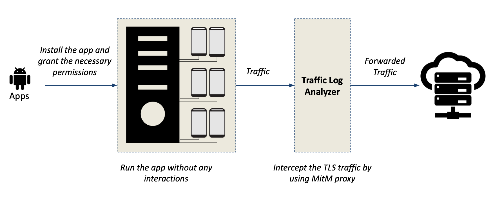

# GDPR-Consent
Code for our paper: ["Share First, Ask Later (or Never?) - Studying Violations of GDPR's Explicit Consent in Android Apps" (USENIX Security 2021)](https://publications.cispa.saarland/3400/1/nguyen2021gdpr.pdf)

*Overview*: Our main goal is to have a mostly automated and scalable solution to detect personal data that is being sent to the Internet without users’ explicit consent, as is mandated by the GDPR. We set up an array of Android devices, on which we run each app (without any interaction) and capture the network traffic. Based on personal data which is directly tied to the phone, we automatically detect this data in both plain and encoded form through string matching. Further, we derive a methodology that allows us to pinpoint data that may be other unique identifiers and manually validate whether this can be used to track the user/device.

# Prerequisite
1. A rooted Android device (note that all of our testing has been taking place on a Pixels, Pixel 3a, and Nexus
5 that are running Android 8 or 9).
2. Installing Frida for your devices (see this tutorial https://frida.re/docs/android/)
3. Installing mitmproxy for your server as well as the mitmproxy CA certificate has to be installed on the client Android devices (see this documentation https://docs.mitmproxy.org/stable/)

# How to Install
1. Clone this repository and install all the dependencies with pip (`pip install -r requirements.txt`)
2. Start the Frida server on your Android devices
3. Start the mitmproxy on your server machine and change the network setting on your Android devices to your Proxy server  

# How to Use
 In the following, we show how to collect the app network traffic and detect persona data that is being sent to the Internet without user consent
 
## Network Traffic Analysis: 

In the first step of our analysis pipeline, we aim to identify apps that send some data when started. To achieve that, we install the app in question and grant all requested permissions listed in the manifest, i.e., both install time and runtime permissions. Subsequently, we launch the app and record its network traffic.

`python network-traffic-analysis.py -s FA6AL0309062 -p 8080 -f apk_file_input.csv -o output/`

| Parameter  | Description |
| ------------- | ------------- |
| -s  | The Android device serial number  |
| -p  | The port of proxy server  |
| -f  | The csv file that contains package name and the corresponding path to the apk file. For example: each line in this csv file is a `"package_name","file_path"`  |
| -o  | The output directory |

## Traffic Log Analyzer (String-Matching Device-Bound Data): 

The second step is to identify personal data that is tied to the phone, such as the location, the AAID, or the MAC address. Since such information is accessible by apps, we extract the relevant values from the phone through the Android debug bridge to ensure we know these values for each phone.

| Data Type  | Description |
| ------------- | ------------- |
|AAID | Android Advertising ID|
|BSSID | Router MAC addresses of nearby hotspots|
|Email | Email address of phone owner|
|GPS | User location|
|IMEI | Mobile phone equipment ID|
|IMSI | SIM card ID|
|MAC | MAC address of WiFi interface|
|PHONE | Mobile phone’s number|
|SIM_SERIAL | SIM card ID|
|SERIAL | Phone hardware ID (serial number)|
|SSID | Router SSIDs of nearby hotspots|
|GSF ID | Google Services Framework ID|

To detect the above data, you can use this script (note that there are some data that could not be easily extracted by adb command, so you can use the Device ID app to get them, and then update this data accordingly in the script, i.e., the DEVICE_PII_DICT and GPS_DICT variables):

`python detecting-pii-string-matching.py -s FA6AL0309062 -f apk_file_input.csv -d output/`

| Parameter  | Description |
| ------------- | ------------- |
| -s  | The Android device serial number  |
| -f  | The csv file that contains package name and the corresponding path to the apk file. For example: each line in this csv file is a `"package_name","file_path"`  |
| -d  | The directory that contains the output of the network traffic analysis|

## Detecting Potentially Unique Tracking Identifiers Detector
To detect potentially unique tracking identifiers, you could use the above scripts and then follow our workflow in the paper.
